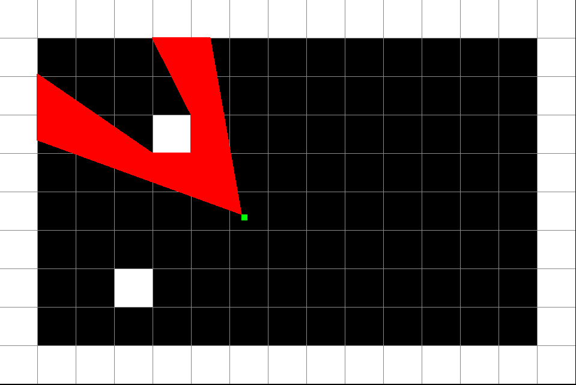
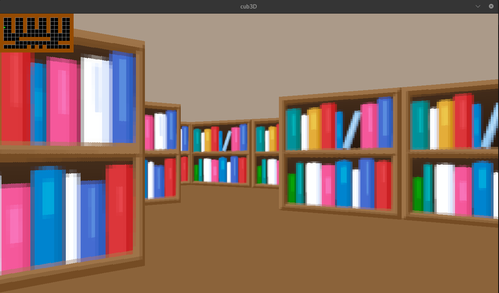

<h1 align="center"> 
  🕹️ cub3D 
</h1> 

<p align="center">
  
  
  
  
</p>

# 💡 About the project

Cub3D is a 3D game engine built using raycasting, inspired by the early Wolfenstein 3D game.
It's a very exciting project and it serves as a great introduction to computer graphics, 
game engines, and player interaction.

# 🔍 Overview




The game features a simple FPS-like environment where the player can move around a map and see 
walls rendered in 3D based on their point of view. The project includes:

    🧱 Wall rendering using raycasting

    🧭 Player movement and rotation

    📦 Texturing for walls and floors

    🌈 RGB color parsing for ceiling and floor

    🗺️ Map validation with custom .cub file parser

    🎮 Real-time rendering loop with user input handling

# 🛠️ Usage

### Requirements

This project is written in C and requires the cc compiler.

### Instructions

To compile the project, simply run:

```shell
$ make
```

2. Running the program

Once compiled, you can launch the game using:

```shell
$ ./cub3D assets/maps/map.cub
```

Use the arrow keys or WASD to move and rotate the player. Escape (ESC) will close the game.

3. Map files format

The .cub configuration file defines the map and game parameters. It includes:

    Paths to wall textures (NO, SO, EA, WE, PO)

    RGB color values for floor and ceiling

    The 2D map layout using:

        1 for walls

        0 for empty space

        4 for doors

        N, S, E, W to place the player and define starting direction

# 📌 Note

- Make sure your .cub map file is correctly formatted and closed (surrounded by walls).
- This project strictly enforces error handling, so improper maps will be rejected with helpful error messages.
- MiniLibX must be correctly installed and linked. You can check the Makefile for more info on how it’s used.
